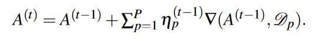

许多数据并行的ML算法使用SGD，并用如下公式更新梯度：

 称作步长

SGD对初始步长非常敏感。GraphLab’s SGD MF, MLlib’s SGD LR使用固定的初始步长，然后若干次迭代后，衰减步长

比较好的是从一个合理区间取一个步长，然后动态调整步长

AdaRevision 通过对每个参数维护一个历史累积梯度，每次梯度更新需要更新参数和该历史累积梯度。
client读取最新参数和该历史累积梯度的snapshot，client计算梯度，并更新本地参数和历史累积梯度的snapshot，client的本地参数和历史累积梯度的snapshot 跟server端的对比，时效性越差，步长越小。

