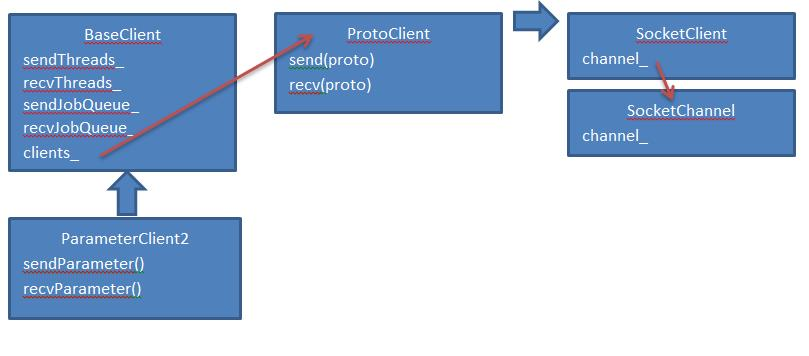
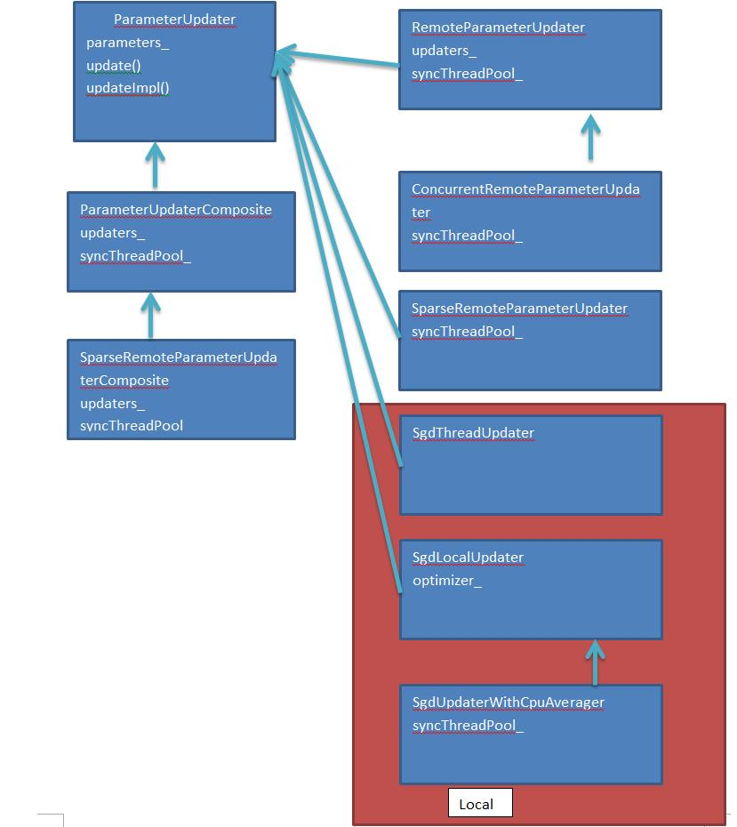

# Paddle 源码阅读 #

## 安装Paddle ##
### 下载paddle镜像 ###
	docker pull paddledev/paddle:cpu-demo-latest
### 启动Paddle容器 ###
	docker run -it paddledev/paddle:cpu-demo-latest
	cd /root/paddle

## 单机运行Paddle ##

	cd demo/recommendation
	sh run.sh

## Debug paddle ##
执行下面命令

	export DEBUGGER="gdb --args"
	cd demo/recommendation
	sh run.sh
如果没有安装gdb，执行命令
	apt-get install gdb

分布式运行可以去节点上通过gdb --pid命令debug

### 分布式debug paddle ###
编译debug版本
	cmake .. -DCMAKE_BUILD_TYPE=Debug -DWITH_GPU=OFF -DWITH_DOC=OFF
	cmake .. -DWITH_GPU=OFF -DWITH_DOC=OFF
	make -j24
	make install

node1上

	cd /home/paddle/JOB20160920025152
	paddle pserver  --num_gradient_servers=2 --nics=eth0 --port=7164 --ports_num=2 --ports_num_for_sparse=2 --comment=paddle_process_by_paddle

node2上

	cd /home/paddle/JOB20160920025152
	paddle pserver  --num_gradient_servers=2 --nics=eth0 --port=7164 --ports_num=2 --ports_num_for_sparse=2 --comment=paddle_process_by_paddle

node1上
	
	cd /home/paddle/JOB20160920025152
	export GLOG_logtostderr=0 
	export GLOG_log_dir="./log"
	export DEBUGGER="gdb --args"
	
	paddle train  --num_gradient_servers=2 --nics=eth0 --port=7164 --ports_num=2 --comment=paddle_process_by_paddle --pservers=172.17.0.7,172.17.0.8 --trainers=172.17.0.7:7050,172.17.0.8:7050 --use_svb=1  --ports_num_for_sparse=2 --config=./trainer_config.py --use_svb=1 --trainers=172.17.0.7:7050,172.17.0.8:7050 --trainer_count=4 --use_gpu=0 --num_passes=10 --save_dir=./output --log_period=50 --dot_period=10 --saving_period=1 --local=0 --trainer_id=0
	
node2上

	paddle train  --num_gradient_servers=2 --nics=eth0 --port=7164 --ports_num=2 --comment=paddle_process_by_paddle --pservers=172.17.0.7,172.17.0.8 --trainers=172.17.0.7:7050,172.17.0.8:7050 --use_svb=1  --ports_num_for_sparse=2 --config=./trainer_config.py --use_svb=1 --trainers=172.17.0.7:7050,172.17.0.8:7050 --trainer_count=4 --use_gpu=0 --num_passes=10 --save_dir=./output --log_period=50 --dot_period=10 --saving_period=1 --local=0 --trainer_id=1

## 分布式运行 ##
### 准备环境 ###
安装sshd:

	apt-get install openssh-server
	/etc/init.d/ssh start
	ssh-keygen -t rsa

运行另一个paddle容器并准备ssh环境

	docker run -it paddledev/paddle:cpu-demo-latest
	apt-get install openssh-server
	/etc/init.d/ssh start
	ssh-keygen -t rsa

把两个容器的key加入到~/.ssh/authorized_keys

### 启动分布式paddle ###
	cd paddle/scripts/cluster_train
修改conf.py

	HOSTS = [
        "root@172.17.0.7",
        "root@172.17.0.8",
        ]
	export PATH_TO_LOCAL_WORKSPACE=/root/paddle/demo/recommendation
	sh run.sh

提示no model named fabric.api

	pip install fabric

root@172.17.0.7上的启动命令是：

	[root@172.17.0.7] run: cd /home/paddle/JOB20160831115853; GLOG_logtostderr=0 GLOG_log_dir="./log" nohup paddle pserver  --num_gradient_servers=2 --nics=eth0 --port=7164 --ports_num=2 --ports_num_for_sparse=2 --comment=paddle_process_by_paddle > ./log/server.log 2>&1 < /dev/null &
	[root@172.17.0.7] run: cd /home/paddle/JOB20160831115853; GLOG_logtostderr=0 GLOG_log_dir="./log" nohup paddle train  --num_gradient_servers=2 --nics=eth0 --port=7164 --ports_num=2 --comment=paddle_process_by_paddle --pservers=172.17.0.7,172.17.0.8  --ports_num_for_sparse=2 --config=./trainer_config.py --trainer_count=4 --use_gpu=0 --num_passes=10 --save_dir=./output --log_period=50 --dot_period=10 --saving_period=1 --local=0 --trainer_id=0 > ./log/train.log 2>&1 < /dev/null &
root@172.17.0.8上的启动命令是：

	[root@172.17.0.8] run: cd /home/paddle/JOB20160831115853; GLOG_logtostderr=0 GLOG_log_dir="./log" nohup paddle pserver  --num_gradient_servers=2 --nics=eth0 --port=7164 --ports_num=2 --ports_num_for_sparse=2 --comment=paddle_process_by_paddle > ./log/server.log 2>&1 < /dev/null &
	[root@172.17.0.8] run: cd /home/paddle/JOB20160831115853; GLOG_logtostderr=0 GLOG_log_dir="./log" nohup paddle train  --num_gradient_servers=2 --nics=eth0 --port=7164 --ports_num=2 --comment=paddle_process_by_paddle --pservers=172.17.0.7,172.17.0.8  --ports_num_for_sparse=2 --config=./trainer_config.py --trainer_count=4 --use_gpu=0 --num_passes=10 --save_dir=./output --log_period=50 --dot_period=10 --saving_period=1 --local=0 --trainer_id=1 > ./log/train.log 2>&1 < /dev/null &

Paddle的架构如上图所示，paddle在每台节点启动PServer和Trainer的两个进程。
### PServer进程 ###

PServer进程：入口paddle/pserver/ParameterServer2Main.cpp

在paddle/pserver/ParameterServer2Main.cpp:34看到启动ParameterServer2的数量

	int numPorts = FLAGS_ports_num + FLAGS_ports_num_for_sparse;

例子中ports_num + ports_num_for_sparse=4

ParameterServer2类继承ProtoServer类继承SocketServer。并在paddle/pserver/LightNetwork.cpp:191 SocketServer::tcpServer会启动tcpserver，接收客户端连接，每个连接创建SocketWorker线程类。SocketWorker类中接收数据，处理参数pull和push请求。

SocketWorker类有2个成员变量，channel负责网络收发，server负责处理请求。

	std::unique_ptr<SocketChannel> channel_;
	SocketServer* server_;

### Trainer进程 ###
主线程的堆栈

	Thread 1 (Thread 0x7f60c34f4780 (LWP 1893)):
	#0  sem_wait () at ../nptl/sysdeps/unix/sysv/linux/x86_64/sem_wait.S:85
	#1  0x0000000000619ff3 in wait (this=<optimized out>) at /root/paddle/paddle/utils/Locks.h:144
	#2  waitOutArgsReady ()
	at /root/paddle/paddle/gserver/gradientmachines/MultiGradientMachine.h:367
	#3  paddle::MultiGradientMachine::getOutArgs ()
	at /root/paddle/paddle/gserver/gradientmachines/MultiGradientMachine.cpp:357
	#4  0x0000000000618a3e in paddle::MultiGradientMachine::forwardBackward()
	at /root/paddle/paddle/gserver/gradientmachines/MultiGradientMachine.cpp:291
	#5  0x000000000066205c in paddle::TrainerInternal::forwardBackwardBatch() 
	at /root/paddle/paddle/trainer/TrainerInternal.cpp:299
	#6  0x0000000000662ab7 in paddle::TrainerInternal::trainOneBatch ()
	at /root/paddle/paddle/trainer/TrainerInternal.cpp:117
	#7  0x000000000065da30 in paddle::Trainer::trainOnePass ()
	at /root/paddle/paddle/trainer/Trainer.cpp:434
	#8  0x0000000000661247 in paddle::Trainer::train ()
	at /root/paddle/paddle/trainer/Trainer.cpp:280
	#9  0x000000000050b083 in main ()
	at /root/paddle/paddle/trainer/TrainerMain.cpp:100

主线程初始化会启动FLAGS_trainer_count个TrainerThread对象异步计算，例子中是4个paddle/gserver/gradientmachines/MultiGradientMachine.cpp:134

主线程MultiGradientMachine::forwardBackward

1. 调用forwardImp，后者调用startTask，让TrainerThread负责真正的计算，通过getOutArgs()等待计算结果。
2. 调用backwardImp，后者对cpu参数调用updateCallback，在回调中向PServer更新参数。

  

回调函数:
	
	UpdateCallback updateCallback =
	  [this, showStats, &paraStats](Parameter* para) {
		if (showStats) {
		  //! @TODO(yuyang18) Show stats is actually a ParameterHook, refactor
		  // it
		  //! to ParameterHook.
		  auto& grad = para->getBuf(PARAMETER_GRADIENT);
		  paraStats[para->getID()].avgAbsGrad = grad->getAbsSum() / para->getSize();
		  paraStats[para->getID()].maxAbsGrad = grad->getAbsMax();
		}
		parameterUpdater_->update(para);
	};

ParameterUpdater::update调用虚函数updateImpl
RemoteParameterUpdater::updateImpl直接调用localUpdater_->update(para)

更新参数是异步的，主线程中会创建SparseRemoteParameterUpdater和RemoteParameterUpdater两个线程。跟启动参数中ports_num+ports_num_for_sparse对应。可以看出Sparse和非Sparse是分开的。

RemoteParameterUpdater类和SparseRemoteParameterUpdater类中创建ParameterClient2类负责网络收发。

BaseClient类中启动一组接收线程，接收队列，发送线程，发送队列，数量等于实际PServer数量。

	/// nodes * ports that means the number of real pservers
	int serviceNum_;

假如有n个PServer进程，sendParameter()把参数或数据放到n个sendJobQueue_里面，n个sendThread_从各自的sendJobQueue_取出并同时发送到n个PServer。避免网络拥塞。以下是代码中原话，作者假设pserver最多就几百个，这种基于线程的并行方式是有效的，对于更大的集群，可能会有问题。

	/**
	 * threads num for managing all services. Normally the
	 * number of pservers are relatively less than several
	 * hundreds so that using thread-based parallelization
	 * can benifit traffic performance and pserver's sgd
	 * optimization performance.
	 */
	int threadNum_;

ParameterUpdaterCreators根据配置文件创建相应的ParameterUpdater。

SgdThreadUpdater，SgdLocalUpdater，SgdUpdaterWithCpuAverager是local的ParameterUpdater，不需要连接PServer。其他的是remote的ParameterUpdater需要连接PServer。

在Trainer::init paddle/trainer/Trainer.cpp:240中，初始化ParameterUpdater，
trainerInternal_.getParameterUpdater()->init(parameters);

paddle::SendParameterRequest

docker run -d -it -v /home/wangzuo/paddle:/root/paddle paddledev/paddle:cpu-demo-latest

main函数在TrainerMain.cpp，其中创建Trainer对象
Trainer::init中调用initMain,initPython准备，创建TrainerInternal对象
TrainerInternal::init中根据配置文件创建ParameterUpdater和GradientMachine对象
MultiGradientMachine的构造函数中创建numThreads_个TrainerThread对象，并调用TrainerThread::start()

TrainerThread的构造函数根据配置文件创建NeuralNetwork

在TrainerThread::start()调用NeuralNetwork::start()，并创建4个线程，

1. computeThread(): performing forward(), backward(), prefetch().
2. valueDispatchThread(): copying parameter values to partner thread.
3. copyGradToBufferThread(): copying parameter gradient to partner thread.
4. gradCollectThread(): merging the gradient from step 3 with local gradient

computeThread()线程接收到命令MultiGradientMachine::TASK_FORWARD_BACKWARD，调用TrainerThread::forward()和TrainerThread::backward()

TrainerThread::forward()
从MultiGradientMachine拷贝inArgs到TrainerThread
梯度清零
等待参数同步完成
调用NeuralNetwork::forward()
通知MultiGradientMachine，outArgs计算好了

NeuralNetwork::forward()
用inArgs填充DataLayer
调用每个Layer的forward()函数
将OutputLayer的输出填充outArgs

TrainerThread::backward()
将outArgs中的梯度传输到每个线程
调用NeuralNetwork::backward()，后者调用每个Layer的backward()
merge cpu梯度

如果不是cpu梯度，使用valueDispatchThread()，copyGradToBufferThread()，gradCollectThread()合并梯度。

TrainerThread::mergeCpuGradients()
在Barrier上等待所有TrainerThread::computeThread()线程
所有TrainerThread::computeThread()线程同时合并梯度，每个线程合并一部分

##gpu参数合并和更新

2. valueDispatchThread(): copying parameter values to partner thread.
3. copyGradToBufferThread(): copying parameter gradient to partner thread.
4. gradCollectThread(): merging the gradient from step 3 with local gradient.

gpu参数合并，每个参数指定一个主线程id，每个线程的上一个线程是partner。从该参数的主线程开始合并，直到最后一个线程。

##编译paddle
cd zeromq-4.1.4
./configure --with-libsodium=no --with-libgssapi_krb5=no
apt-get install automake
make install
cd paddle/build
make install

