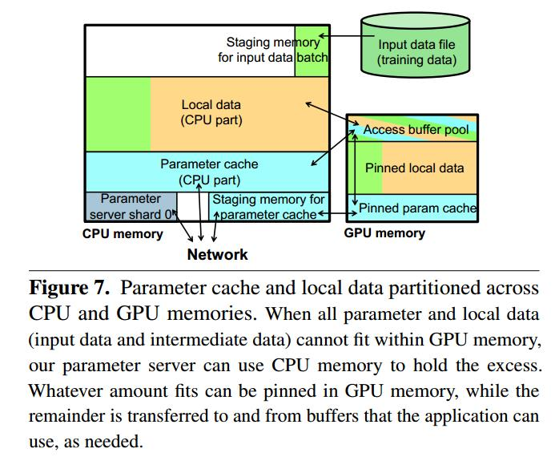

GeePS把参数分片，每个Parameter Server存储一个Parameter Server Shard。在BSP的每个clock，Parameter Server Shard更新到Parameter cache。参数更新首先修改Parameter cache，在BSP的每个clock，写回（write-back）Parameter Server Shard。Parameter cache有两部分，GPU-pinned parameter cache 和 CPU parameter cache。 GPU内存不够用，才会使用CPU parameter cache（参照一下data placement policies）。GPU内存中有块access buffer pool，Read and PreUpdate 从这申请空间，PostRead or Update把空间释放。 图中local data部分是应用的 input data and intermediate states， 同样包含GPU-pinned part和CPU part。

GeePS启动allocator thread 和 reclaimer thread，调用路劲如下
GeePS::StartIterations()
->ClientLib::start_opsqp()
->启动allocator thread 和 reclaimer thread

allocator thread负责申请空间，处理Read，Preupdate，localAccess命令
reclaimer thread负责释放空间，处理PostRead，Update，PostlocalAccess，Clock命令

在ClientLib::init_comm_channel中，初始化CommunicationChannel，包括RouterHandler（调用start_handler_thread启动消息处理线程），ClientServerEncode，ServerClientDecode，WorkPusher，CachedTables，并启动bg_worker_thread，server_thread。
server_thread的入口ServerThreadEntry，会初始化RouterHandler，ClientServerEncode，TabletStorage，ServerClientDecode等类，并调用RouterHandler的do_handler，处理消息。

