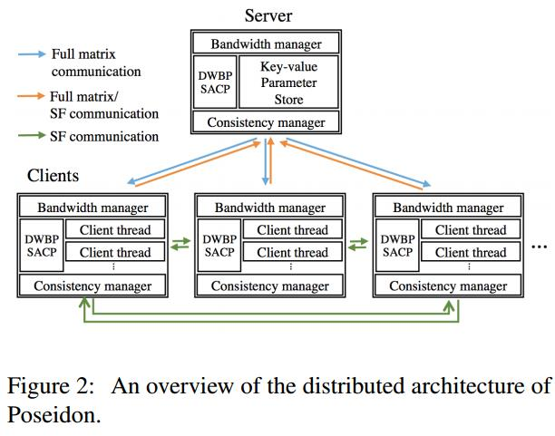

a three-level hybrid architecture that
supports both CPU and GPU computation, a distributed
wait-free backpropagation (DWBP) scheme to interleave
computation with inter-machine communication, and a
structure-aware communication protocol (SACP) that reduces the size of network messages. 

 First, We add an additional hierarchy within each
worker node, thus allow multiple client threads coexisting in a single worker machine