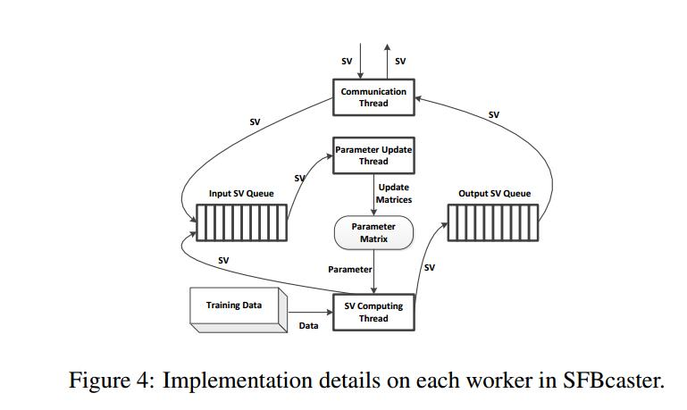

深度学习的几个优化：

1. 1 bit sgd
	
	1-Bit Stochastic Gradient Descent and Application to Data-Parallel Distributed Training of Speech DNNs 

2. sfb：

	SFB vs client-server architectures:

	Although client-to-server costs are reduced (by sending SFs), server-to-client
	costs are still expensive because full parameter matrices need to be sent.  In contrast, the peer-to-peer SFB topology never sends full matrices; only SFs are sent over the network. (cs架构，c端向s端发送SF，s端向c端发送整个matix，p2p架构则只发送SF，通信开销低)

	We also note that under SFB, the update matrices are reconstructed at each of the P machines, rather than once at a	central server (for full-matrix architectures). Our experiments show that the time taken for update reconstruction is empirically negligible compared to communication and SF computation（cs架构，只需在s端执行一次重构matrix和更新参数，p2p架构则需要在所有c端执行同样的操作，实验比较下来还是p2p架构开销低）

	

	One worker is in charge of
	measuring the objective value. Once the algorithm converges, this worker notifies all other workers
	to terminate the job.

	The decentralized architecture of SFBcaster makes it robust to machine failures:new workers can be added and existing
	workers can be taken offline, without restarting the running framework
	
	Pengtao Xie, Jin Kyu Kim, Yi Zhou, Qirong Ho, Abhimanu Kumar, Yaoliang Yu, and Eric Xing. Distributed Machine Learning via Sufficient Factor Broadcasting. In arXiv, 2015.

3. oplog：

	
	OpLog: a library for scaling update-heavy data structures

4. geeps：针对GPU优化PS

	- explicit use of GPU memory for the parameter cache
	
		perform these data movement steps in the background， overlapping them with GPU computing activity（数据移动和GPU计算overlap，不会影响性能）

		read or update within the GPU memory（直接在GPU内存中读取和更新）

		enables updating of the parameter cache state using GPU parallelism（更新参数缓存使用GPU并行提速）
		
	- batch-based parameter access methods

		per-value read and update operations are slow（GPU适合SIMD的操作，单值操作效率低）

		supports batch-based interfaces for reads and updates（geeps支持适合GPU的批量操作）

		pre-built indexes for an entire batch that enable GPU-efficient parallel “gathering” and updating of the set of parameters accessed in a batch（预先建立index，方便GPU的gather操作）

	- parameter server management of GPU memory on behalf of the application

		managing the GPU memory for the application（Read, PostRead, PreUpdate,Update等接口，管理GPU内存的使用）

		swapping the data that is not currently being used to CPU memory（GPU内存不够，swap到CPU内存，swap操作和GPU计算overlap，不影响性能）

	GeePS: Scalable deep learning on distributed GPUs with a GPU-specialized parameter server

5. easgd

	Deep learning with Elastic Averaging SGD